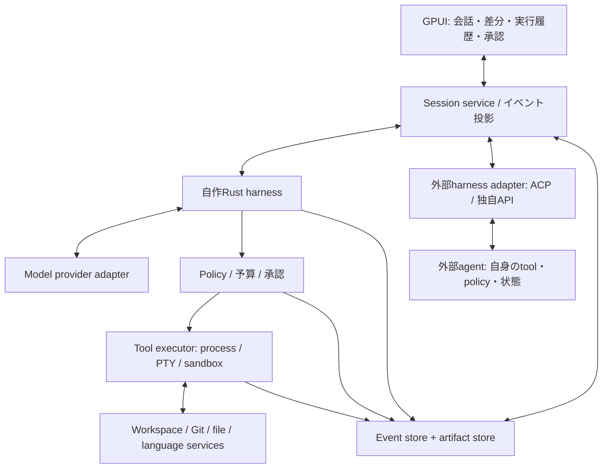

# 推奨アーキテクチャ

以下は**未実装の設計提案**。UI/agent分離、構造化イベント、最小core、environment分離という比較上の知見を組み合わせた。[^zed-profile][^codex-profile][^pi-profile][^openhands-profile]

## 二つの実行経路

自作経路ではRust coreがloop、policy、tool実行を所有する。外部経路ではそのagentが実行を所有する。共通化するのは表示・セッションへの参照・記録・ユーザー操作であり、内部の制御能力まで同一だと主張しない。

外部agentが自身でshellやfileを操作する場合、GPUIの承認ダイアログだけで全操作を制限できない。必要な境界はagent processを囲うOS/containerの設定か、実際に有効なprotocol仲介によって確保する。

## モジュール境界

| モジュール案 | 所有するもの | 所有しないもの |
| --- | --- | --- |
| app-gpui | window、focus、IME、表示用Entity、selection | provider待ち、長いDB処理、shell |
| session-service | session/turn状態、入力queue、subscription | OSの権限実装 |
| harness-core | loop、context予算、tool選択、停止条件 | GPUI型、provider固有JSON |
| model-adapters | streaming解析、能力表、usage、error変換 | 最終permission決定 |
| tool-executor | process、PTY、file操作、timeout、隔離 | UIの再描画 |
| workspace-service | path、buffer/disk version、diff、Git、LSP | モデルの推論 |
| persistence | event、snapshot、artifact、migration | 意図不明な副作用の自動再実行 |
| harness-adapters | protocol変換、機能差、認証経路の表示 | 外部agent内部の完全な制御 |

最初から各行を別crateに分ける必要はない。依存方向を守ったmoduleとして始め、変更頻度やテスト境界が明確になったものを切り出す。

## UIと非同期runtime

GPUIの表示更新と、HTTP/PTY/検索/DBの処理を分離する。Tokio等のruntimeへ命令を送り、bounded channelで結果を返す。容量付きchannelは生産側と消費側の速度差を制御する手段になる。[^tokio-channels]

表示用のdeltaはまとめて反映するが、承認、tool開始/終了、error、完了は落とさない。タスクのwindow寿命とsession寿命を分け、window消滅後の更新を失敗として処理する。GUIを閉じると終了するのか、backgroundに残るのかも明示的に決める。

## 最小のイベント契約

| 種類 | 必須にしたい情報 |
| --- | --- |
| SessionCreated / TurnStarted | session_id、turn_id、workspace_id、設定snapshot |
| ModelRequestStarted / MessageDelta | provider、model、request_id、sequence |
| ToolProposed | tool_call_id、schema版、引数、入力元、副作用区分 |
| ApprovalRequested / Decided | request_id、対象scope、理由、期限、policy版、決定 |
| ToolStarted / Finished | invocation_id、cwd、実行場所、終了code、artifact参照 |
| ContextCompacted | 元event範囲、要約、保持した制約、token計測 |
| TurnCompleted / Failed / Cancelled | 終了理由、費用、未完了tool、成果物 |
| RecoveryNeeded | 最後のdurable event、結果不明の副作用、確認事項 |

共通envelopeにはschema_version、event_id、session内sequence、wall clock、関連IDを持たせる。時刻順だけで順序を決めず、重複受信をIDで排除する。tokenやcostが未取得なら0ではなくunknownにする。

## 永続化と再開

推奨案は単一ローカルDBを正本にし、eventから表示状態を再構築する方式。大きなtool出力・画像・file snapshotはcontent-addressed artifactとして別保存する。JSONLはexportとdebugに使い、DBとJSONLを二重の正本にしない。

SQLite WALは読書き並行性の候補だが、writer数、checkpoint、同期設定を設計する必要があり、network filesystem上の共有DBには向かない。[^sqlite-wal]
UI threadでDB待ちをせず、一つの書込み経路へまとめる。DB transactionとblob保存の途中で落ちた場合も検出できるよう、仮保存→rename→参照commitの順序と孤立blob回収を定義する。

## 実行前後の境界

command等は「提案を記録→policy判定→必要な承認→実行開始を記録→実行→結果を記録」と進める。ただし記録と外部副作用を一つの原子的transactionにはできない場合がある。

再起動後に「実行開始は記録済み、完了は不明」なら、勝手に再実行しない。read操作は再試行可能でも、公開・送信・課金等は実行先照会か人の判断が必要になる。詳細は[復旧](security-recovery.md)。

## Workspaceの一貫性

一つのworkspaceへ書き込む主体を管理する。file読込み時のhash/versionと適用直前の状態が違えばpatchを止め、diffを再計算する。エディターの未保存bufferも状態の一部にする。

初期版は同一workspaceの書込みを直列化する。将来のworktree利用は明示的な選択肢であり、利用者のbranchを暗黙に切り替えない。subagent禁止等のproject方針もruntime設定で維持する。

[^zed-profile]: [Zed・GPUI分析](../products/zed.md)。
[^codex-profile]: [Codex分析](../products/codex.md)。
[^pi-profile]: [Pi分析](../products/pi.md)。
[^openhands-profile]: [OpenHands分析](../products/openhands.md)。
[^tokio-channels]: [Tokio Channels](https://tokio.rs/tokio/tutorial/channels)。
[^sqlite-wal]: [SQLite Write-Ahead Logging](https://www.sqlite.org/wal.html)。

