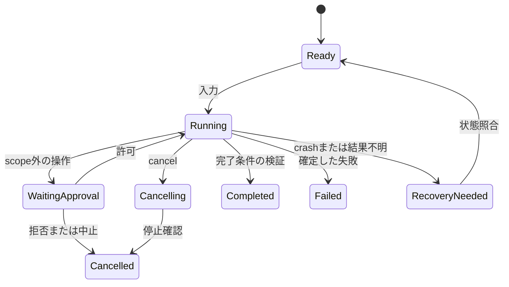

# 権限・隔離・復旧

Claude Codeのsandbox/復元範囲、Clineの自動承認、Piの最小core方針、Copilotのpreview sandbox、LangGraphの永続状態を比較すると、許可・隔離・復元を別の保証として設計する必要がある。[^claude-profile][^cline-profile][^pi-profile][^copilot-profile][^langgraph-profile]

以下は自作側の設計案であり、比較した全製品が同じ対策を実装しているという意味ではない。

## 四つの制御を区別する

| 制御 | 決めること | それだけでは保証しないこと |
| --- | --- | --- |
| 指示 | agentが何をすべきか | 指示違反をOSで防ぐこと |
| policy/approval | どの操作を許可するか | commandが実際に触れる全資源の限定 |
| sandbox | processが触れるfile/network等 | 生成物の正しさ、許可領域内の誤操作 |
| checkpoint/backup | 保存した状態へ戻す | 外部公開・送信・課金等の取消し |

## 権限の単位

read workspace、write workspace、process実行、network宛先、秘密情報利用、外部更新・公開を区別する。tool名がreadでも内部で副作用を起こす実装ならread権限とは扱わない。

承認は操作の内容、引数、対象path/host、workspace、tool version、policy versionに結び付ける。承認後に引数が変わったら再評価する。一度許可された範囲の通常作業を毎回止めず、scope外の操作や破壊的操作を別に判断する。

repoの指示やskill、toolの説明、Web取得文を、利用者や運用policyの上位へ昇格しない。モデルによる危険性の分類は補助として扱い、決定的な禁止規則を上書きしない。

## 実装上の失敗例と対策案

| 失敗 | 対策案 | 検証方法 |
| --- | --- | --- |
| pathの外側へ書込み | 正規化だけに頼らずsymlink/handle境界で制約 | symlink入替え、../、case/Unicode差 |
| 許可したcommandが別操作も実行 | shell文字列とargv実行を区別、OS境界を併用 | pipe、redirect、subprocessを含むfixture |
| childだけ残るcancel | process group/job、段階的終了、timeout | child/grandchildを作るcommand |
| 外部toolに秘密が流れる | 環境変数を限定、credential broker、ログmask | 偽secretを使う入力・出力fixture |
| MCPやpluginからpolicyを変更 | policyの所有者を分離、extensionを別境界に置く | 悪意あるtool説明をdataとして処理 |
| 同時編集で人の変更を破壊 | preimage hashとbuffer versionの確認 | 読込後に人が同じfileを編集 |
| preview終了後にserverが残る | 所有processとportの管理、終了手順 | window閉鎖・crash・session削除 |

ネットワーク制御は文字列のhostname確認だけで完結させず、実際の接続経路で適用する。外部agentを使う時もどのprocessが制約されているかを確認する。

## 復旧の粒度

| 復元対象 | 保存するもの | 自動再試行の考え方 |
| --- | --- | --- |
| 会話・計画 | 完全eventと要約/分岐参照 | 再表示できるが、model再生成は同一結果を保証しない |
| toolによるfile編集 | preimage、postimage、hash、path | 現fileが想定postimageと一致する時だけ逆適用を検討 |
| shellでのfile変更 | snapshotまたは専用作業tree | shellの全副作用はdiffだけでは捕捉できない |
| process/PTY | process識別子、状態、出力offset | 再接続可能か、失われたかを確認 |
| 外部APIの更新 | request ID、冪等key、実行先の結果 | 結果不明なら照会し、未確認のまま再送しない |
| container/remote環境 | image、mount、snapshot、環境ID | session DBと環境寿命を別に復旧 |

「exactly-once実行」を安易に保証しない。特にcrashが外部副作用の後・結果保存の前に起きる場合、二重実行の可能性がある。operationごとのidempotencyか確認手順が必要となる。

## 人の介入の状態機械

実行中の追加指示はqueue（次task）かsteering（現task）を選べるようにする。キャンセル要求と停止完了を同じ表示にしない。承認待ちに接続が切れた場合、既定で許可したことにしない。

## 「完了」の表示条件

agentの最終発話だけを完了証拠にしない。停止理由、保留toolの有無、変更一覧、検証の実行結果、未検証項目を揃える。testが「起動できた」「実行された」「成功した」は別状態である。

関連: [アーキテクチャ](architecture.md)、[評価計画](evaluation.md)。

[^claude-profile]: [Claude Code分析](../products/claude-code.md)。
[^cline-profile]: [Cline分析](../products/cline.md)。
[^pi-profile]: [Pi分析](../products/pi.md)。
[^langgraph-profile]: [LangGraph・Deep Agents分析](../products/langgraph-deepagents.md)。
[^copilot-profile]: [Copilot分析](../products/copilot.md)。

